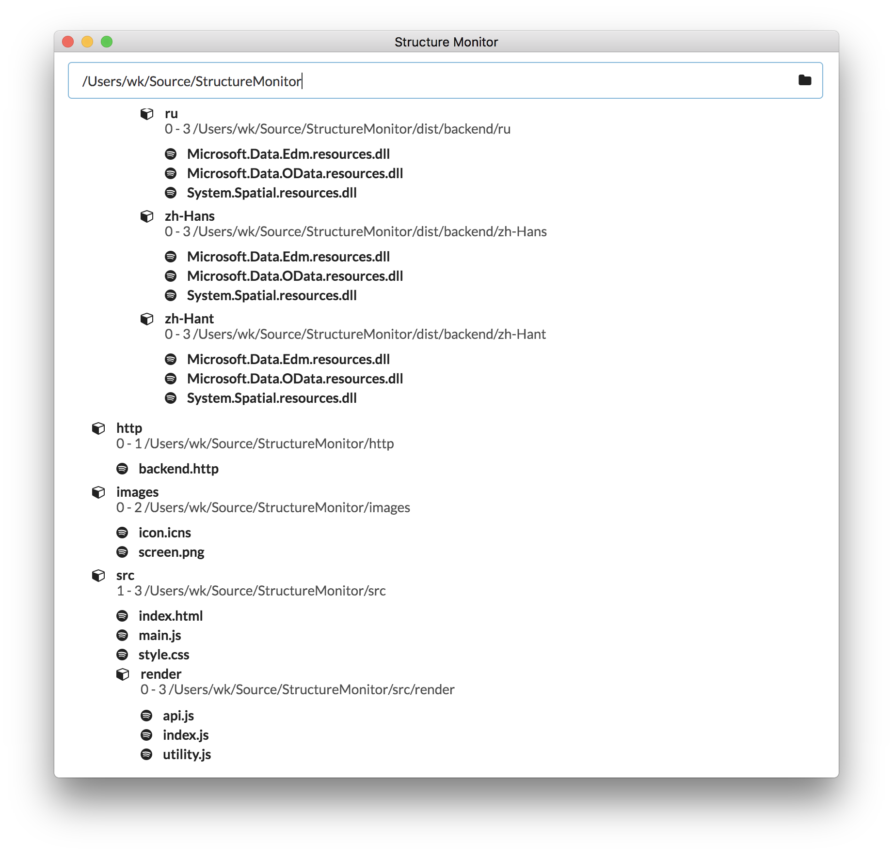

## Structure Monitor



## Development

```bash
dotnet build Backend/StructureMonitor/StructureMonitor.fsproj
dotnet run --project Backend/StructureMonitor/StructureMonitor.fsproj

# watch mode
d-project backend/StructureMonitor/StructureMonitor.fsproj
dotnet watch run

# create release
dotnet publish -c release -r osx.10.12-x64 -o ../../dist/backend /p:LinkDuringPublish=false backend/StructureMonitor
```